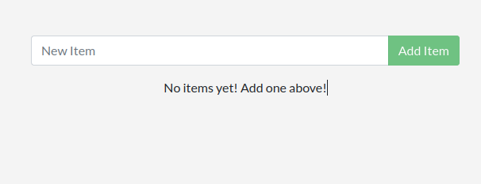

# Application sets

## Learning Goals

- Trying out a pull request based application set

## Introduction

In this exercise we will try out a pull request based application set. We will try to create an application set that will create an application for each pull request in a repository.

## Application set

The sole responsibility of the ApplicationSet controller is to create, update, and delete `Application` resources within the Argo CD namespace. The controller's only job is to ensure that the Application resources remain consistent with the defined declarative ApplicationSet resource, and nothing more.

Thus the ApplicationSet controller does not create/modify/delete Kubernetes resources (other than the Application CR)

## Exercise

### Overview

- Create an applicationset manifest
- Test with a pull request
- Close the pull request

### Step by step instructions

<details>
<summary>More Details</summary>

#### Create an applicationset manifest

In the `applicationsets` directory there is a file called `pull-request.yaml` with the following content:

```yaml
apiVersion: argoproj.io/v1alpha1
kind: ApplicationSet
metadata:
  name: pr-<NUMBER>
  namespace: argocd
spec:
  generators:
  - pullRequest:
      github:
        # The GitHub organization or user.
        owner: <YOUR GITHUB USERNAME> #e.g. eficode-academy
        # The Github repository
        repo: <YOUR GIT REPO> #e.g. argocd-katas

        # Labels is used to filter the PRs that you want to target. (optional)
        labels:
        - test
      requeueAfterSeconds: 180
  template:
    metadata:
      name: 'todo-<NUMBER>-{{branch}}-{{number}}'
    spec:
      project: "default"
      source:
        repoURL: 'https://github.com/eficode-academy/helm-katas.git'
        targetRevision: 'main'
        path: examples/apps/http-server
        helm:
          parameters:
          - name: containerPort
            value: "3000"
          - name: image.repository
            value: releasepraqma/todo-app
          - name: image.tag
            value: latest
          - name: prefix
            value: argo
          - name: app
            value: "todo-{{head_short_sha}}"
      destination:
        server: https://kubernetes.default.svc
        namespace: <YOUR NAMESPACE>
      syncPolicy:
        automated:
          prune: true
          selfHeal: true
```

* edit the file and replace
    * `<YOUR GITHUB USERNAME>` with your github username
    * `<YOUR GIT REPO>` with your git repo
    * `<YOUR NAMESPACE>` with your namespace
    * `<NUMBER>` with your number (student-X)

* Apply the manifest

```bash
kubectl apply -f applicationsets/pull-request.yaml
```

* Make sure that it is there by listing the applicationsets: `k get applicationsets.argoproj.io -n argocd`.

* Look at the status on it by `k describe applicationsets.argoproj.io -n argocd pr-X` where X is your number.

Output should look like the following:

```bash
Name:         pr-0
Namespace:    argocd
Labels:       <none>
Annotations:  <none>
API Version:  argoproj.io/v1alpha1
Kind:         ApplicationSet
Metadata:
  Creation Timestamp:  2023-11-21T21:25:24Z
  Generation:          1
  Resource Version:    75210
  UID:                 ec6e52a5-b41a-4d7b-8f71-2fd1e2ac2078
Spec:
  Generators:
    Pull Request:
      Github:
        Labels:
          test
        Owner:                sofusalbertsen
        Repo:                 argocd-katas
      Requeue After Seconds:  180
  Template:
    Metadata:
      Name:  todo-0-{{branch}}-{{number}}
    Spec:
      Destination:
        Namespace:  student-0
        Server:     https://kubernetes.default.svc
      Project:      default
      Source:
        Helm:
          Parameters:
            Name:         containerPort
            Value:        3000
            Name:         image.repository
            Value:        releasepraqma/todo-app
            Name:         image.tag
            Value:        latest
            Name:         prefix
            Value:        argo
            Name:         app
            Value:        todo-{{head_short_sha}}
        Path:             examples/apps/http-server
        Repo URL:         https://github.com/eficode-academy/helm-katas.git
        Target Revision:  main
      Sync Policy:
        Automated:
          Prune:      true
          Self Heal:  true
Status:
  Conditions:
    Last Transition Time:  2023-11-21T21:25:25Z
    Message:               Successfully generated parameters for all Applications
    Reason:                ApplicationSetUpToDate
    Status:                False
    Type:                  ErrorOccurred
    Last Transition Time:  2023-11-21T21:25:25Z
    Message:               Successfully generated parameters for all Applications
    Reason:                ParametersGenerated
    Status:                True
    Type:                  ParametersGenerated
    Last Transition Time:  2023-11-21T21:25:25Z
    Message:               ApplicationSet up to date
    Reason:                ApplicationSetUpToDate
    Status:                True
    Type:                  ResourcesUpToDate
Events:                    <none>
```


#### Test with a pull request

* Create a pull request in your git repo. The change does not matter at this time, since we are not using the source code in the pull request.

* Remember to set the label `test` on the pull request. The label does not exist, so create it in the Github UI.

* Check that an application has been created in ArgoCD

```bash
kubectl get applications -n argocd
```

* Check that an application has been created in your namespace

```bash
kubectl get pods -n <YOUR NAMESPACE>
```

* Get your ingress hostname

```bash
kubectl get ingress -n <YOUR NAMESPACE>
```

* Access the application in your browser (remember to add https:// in front of the hostname)

You should see something like the follwing:



#### Close the pull request

* now close the pull request, and see that the application is deleted from ArgoCD

```bash
kubectl get applications -n argocd
```

</details>

### Clean up

* Delete the applicationset

```bash
kubectl delete -f applicationsets/pull-request.yaml
```

#### Further reading

* [ApplicationSet](https://argocd-applicationset.readthedocs.io/en/stable/)
* [ApplicationSet Generators](https://argocd-applicationset.readthedocs.io/en/stable/Generators/)
* [ApplicationSet Templates](https://argocd-applicationset.readthedocs.io/en/stable/Template/)

